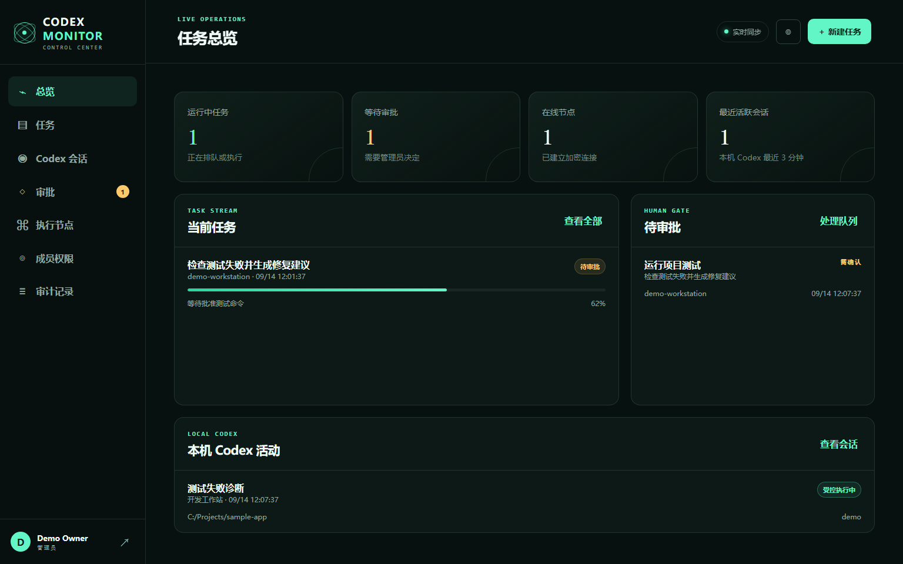
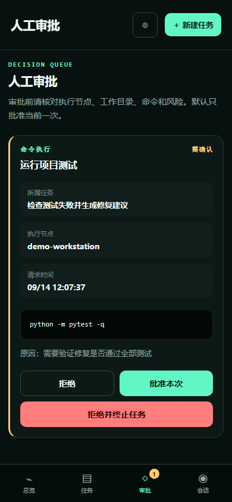

# Codex Monitor

[](https://github.com/yyt-2378/Codex_Monitor/actions/workflows/ci.yml)
[](https://www.python.org/)
[](LICENSE)

一个本地优先的 Codex 任务监控与人工审批控制台。它把任务进度、Codex 会话、执行节点、Markdown 结果和需要人工确认的操作放进同一个适配桌面与手机的网页界面。

> 当前版本是 `0.1.0-alpha` 技术预览，可以独立安装和运行，但尚未发布到 PyPI，也不是已经完成的多租户 SaaS。

## 它监控的是谁的 Codex？

**安装者自己的 Codex。** `codex-monitor` 在安装它的电脑上、以当前系统用户身份启动本机 `codex app-server`。因此它读取的是该系统用户自己的 Codex 登录与会话，不包含作者的账号、密码、Token 或对话。

```text
你的浏览器 / 手机
        │
        ▼
Codex Monitor 网页
        │ 任务、状态与审批
        ▼
你电脑上的 Local Agent
        │ 本机 stdio
        ▼
你已经登录的 Codex
```

如果 Alice 和 Bob 分别安装，它们会分别连接 Alice 和 Bob 当前系统用户的 Codex 数据，不会连接到同一个作者账号。

## 界面预览

### 桌面端任务总览



### 手机端审批队列



截图由仓库内的合成 Demo 数据生成，不包含真实用户会话。

## 当前能力

- 同步本机 Codex 最近会话并查看对话详情
- 从网页创建受管任务或安全续接历史会话
- 展示流式任务阶段、进度、事件和 Markdown 结果
- 处理命令执行与文件修改审批
- 取消运行中的任务
- 管理网页成员角色并记录关键审计事件
- 响应式桌面/手机布局和可安装 PWA
- Windows、Linux 和 macOS 可用的 Python CLI
- Docker/Railway 自托管入口

## 运行 Demo（不读取 Codex）

```bash
git clone https://github.com/yyt-2378/Codex_Monitor.git
cd Codex_Monitor
python -m venv .venv
```

Windows PowerShell：

```powershell
.\.venv\Scripts\Activate.ps1
python -m pip install -e ".[dev]"
codex-monitor demo
```

Linux/macOS：

```bash
source .venv/bin/activate
python -m pip install -e '.[dev]'
codex-monitor demo
```

打开 <http://127.0.0.1:8765>。Demo 自动进入控制台，全部节点、任务、对话和审批均为合成数据，不会启动或读取 Codex。

## 监控当前用户自己的 Codex

先确认当前系统用户已安装并登录 Codex：

```bash
codex --version
codex-monitor doctor
```

然后运行本地一体化模式：

```bash
codex-monitor local --workspace /path/to/your/project
```

Windows 示例：

```powershell
codex-monitor local --workspace "C:\Projects\my-app"
```

首次启动会要求创建 **Codex Monitor 自己的网页管理员账号**。该账号只保护监控网页，不是 OpenAI/Codex账号。默认地址是 <http://127.0.0.1:8765>，数据保存在当前用户的 `~/.codex-monitor/`。

允许多个工作目录时重复参数：

```bash
codex-monitor local --workspace /project/a --workspace /project/b
```

`--workspace` 是安全边界：网页只能把任务派发到列出的目录及其子目录。

## 本地模式与远程模式

| 模式 | 命令 | 用途 |
| --- | --- | --- |
| 合成演示 | `codex-monitor demo` | 展示 UI，不接触 Codex |
| 本地一体化 | `codex-monitor local` | 在一台电脑上同时运行网页与 Agent |
| 独立服务器 | `codex-monitor serve` | 自托管控制中心 |
| 独立执行节点 | `codex-monitor agent` | 将当前电脑的 Codex 连接到自托管服务器 |

远程模式中，真正的 Codex 仍运行在 Agent 所在电脑上。服务器只接收结构化任务、有限事件和审批消息，不需要用户把 Codex 登录凭据上传到服务器。

## 从外网和手机使用

远程模式不要求手机与执行电脑位于同一个局域网。公网服务器负责登录、任务状态和消息转发；安装 Agent 的电脑主动建立出站 WSS 连接，因此不需要给电脑开放公网端口，也不要把本机 Codex App Server 暴露到互联网。

```text
外网手机 / 浏览器
        │ HTTPS
        ▼
公网 Codex Monitor 服务器
        ▲
        │ WSS（电脑主动连接）
        │
用户电脑上的 Agent ──stdio── 用户自己的 Codex App Server
```

手机打开公网地址并登录后，可以查看任务和会话、创建任务以及处理人工审批。电脑必须保持开机，`codex-monitor agent` 也必须保持运行；Agent 离线时，控制台仍可访问已有数据，但不能执行新的 Codex 操作。

## Railway 公网部署：一步一步

以下流程会为单个所有者创建一套独立实例。不要让互不信任的用户共享同一实例。

### 1. 准备仓库和密钥

在 GitHub 上 Fork 本仓库。然后在自己的电脑生成 Agent Token：

```bash
python -c "import secrets; print(secrets.token_urlsafe(48))"
```

保存输出结果，但不要把它提交到 Git、发送给其他人或用作网页密码。网页管理员密码和 Agent Token 必须是两个不同的值。

### 2. 从 GitHub 创建 Railway 服务

1. 在 Railway 新建项目，选择 **Deploy from GitHub repo**。
2. 选择刚刚 Fork 的仓库和 `main` 分支。
3. Railway 会读取仓库根目录的 `Dockerfile` 和 `railway.toml`，构建完成后服务监听 `8080` 端口。

### 3. 设置生产环境变量

进入服务的 **Variables** 页面，添加：

```text
CODEX_MONITOR_ENV=production
CODEX_MONITOR_DATA_DIR=/data
CODEX_MONITOR_ADMIN_USERNAME=your-admin
CODEX_MONITOR_ADMIN_DISPLAY_NAME=Your Name
CODEX_MONITOR_ADMIN_PASSWORD=a-unique-password-of-at-least-12-characters
CODEX_MONITOR_AGENT_TOKEN=the-random-token-generated-in-step-1
```

注意：

- 管理员密码至少 12 个字符，并且不要复用 OpenAI、GitHub 或邮箱密码。
- Agent Token 只配置在 Railway 和执行电脑上，不能放进网页前端或公开仓库。
- 修改变量后等待 Railway 重新部署成功。

### 4. 添加持久卷

在 Railway 项目画布中为该服务添加一个 Volume，并把挂载路径设置为：

```text
/data
```

SQLite 数据库和网页登录信息保存在这里。没有持久卷时，重新部署可能导致数据和管理员账号丢失。当前版本应保持 **一个服务副本**，不要横向扩容多个副本。

### 5. 先生成测试域名

进入服务的 **Settings → Networking → Public Networking**，点击 **Generate Domain**。访问 Railway 生成的 HTTPS 地址：

```text
https://your-service.up.railway.app/api/health
```

正常时会返回包含 `"ok": true` 的 JSON。再打开网站根地址，使用第 3 步配置的管理员账号登录。

### 6. 绑定自己的域名

1. 在 Railway 的 **Public Networking** 中点击 **Custom Domain**。
2. 输入准备使用的域名，例如 `monitor.example.com`，目标端口选择 `8080`。
3. Railway 会显示需要配置的 **CNAME** 和用于所有权验证的 **TXT** 记录。
4. 到域名 DNS 服务商处逐字添加这两条记录，不要自行填写 Railway 的 IP 地址。
5. 等待 Railway 显示验证成功和绿色状态。证书由 Railway 自动签发，之后使用 `https://monitor.example.com` 访问。

只有 CNAME、缺少 TXT 时，自定义域名可能已经解析但仍返回 `404`。DNS 全球生效偶尔可能需要较长时间。

### 7. 在拥有 Codex 的电脑启动 Agent

如果尚未安装 Codex Monitor，先从 GitHub 安装当前版本：

```bash
python -m pip install "git+https://github.com/yyt-2378/Codex_Monitor.git"
```

再确认这台电脑已经安装并登录 Codex：

```bash
codex --version
codex-monitor doctor
```

Linux/macOS：

```bash
export CODEX_MONITOR_AGENT_TOKEN='the-same-token-configured-on-railway'
codex-monitor agent \
  --server https://monitor.example.com \
  --workspace /path/to/project \
  --node-name workstation-1
```

Windows PowerShell：

```powershell
$env:CODEX_MONITOR_AGENT_TOKEN="the-same-token-configured-on-railway"
codex-monitor agent `
  --server https://monitor.example.com `
  --workspace "C:\Projects\my-project" `
  --node-name "workstation-1"
```

不要在 `--server` 后填写 `/ws/agent`；CLI 会自动把 HTTPS 地址转换成安全的 WSS Agent 地址。`--workspace` 可以重复使用，并决定网页允许操作哪些目录。

### 8. 用手机登录

手机不需要安装 Python 或 Codex，直接通过 Wi-Fi、4G 或 5G 打开自定义 HTTPS 地址并登录。可以使用浏览器的“添加到主屏幕”功能把控制台作为 PWA 安装。

### 9. 远程部署排错

| 现象 | 优先检查 |
| --- | --- |
| `/api/health` 无法打开 | Railway 部署日志、Public Networking 和端口 `8080` |
| 自定义域名返回 `404` | Railway 要求的 CNAME 与 TXT 是否都已添加并验证 |
| 登录后没有执行节点 | 电脑上的 Agent 是否仍在运行，Token 是否与 Railway 完全一致 |
| 节点在线但无法运行 Codex | 在执行电脑运行 `codex-monitor doctor`，确认该系统用户已经登录 Codex |
| 部署后账号或任务消失 | Volume 是否连接到正确服务并挂载在 `/data` |
| 网页能打开但连接经常中断 | 代理、防火墙或网络是否允许长连接 WSS |

Railway 相关操作可对照其官方文档：[Dockerfile 部署](https://docs.railway.com/builds/dockerfiles)、[持久卷](https://docs.railway.com/volumes)和[自定义域名](https://docs.railway.com/networking/domains/working-with-domains)。

## 通用 Docker 服务器部署

如果不使用 Railway，可以在自己的 Linux 云服务器运行：

```bash
git clone https://github.com/yyt-2378/Codex_Monitor.git
cd Codex_Monitor
cp .env.example .env
python -c "import secrets; print(secrets.token_urlsafe(48))"
# 编辑 .env，设置独立管理员密码和上面生成的 Agent Token
docker build -t codex-monitor .
docker run -d \
  --name codex-monitor \
  --restart unless-stopped \
  -p 127.0.0.1:8080:8080 \
  --env-file .env \
  -v codex-monitor-data:/data \
  codex-monitor
```

再通过 Caddy、Nginx 或其他反向代理为 `127.0.0.1:8080` 提供 HTTPS，并确保代理支持 WebSocket。不要把未加密的 `8080` 端口直接暴露到公网。

生产部署必须使用 HTTPS、持久卷、强密码、独立随机 Agent Token 和定期备份。当前 SQLite/WebSocket 注册表要求单服务器副本运行。

## 会话写入锁

外部 Codex App、VS Code 或 CLI 可能仍持有某个历史会话的写入权。Codex Monitor 会先把它作为观察会话展示；用户明确续接时，如果原会话存在活动写入者，则通过 `thread/fork` 或上下文交接建立安全副本，避免同时写入同一会话。

## 技术实现

- FastAPI + SQLite 控制服务器
- 原生 HTML/CSS/JavaScript PWA
- WebSocket Agent 通道
- 本机 Codex App Server `stdio` JSON-RPC 适配器
- Argon2 密码哈希、HTTP-only Cookie、CSRF 校验和角色控制

Codex App Server 是 OpenAI 官方提供的产品集成接口，覆盖身份验证、对话历史、审批、线程/轮次控制和流式事件。当前组件让 App Server 留在本机并使用默认 `stdio` 传输，不把实验性 WebSocket 监听器直接暴露到公网。参见 [OpenAI Docs：Codex App Server](https://learn.chatgpt.com/zh-Hans/docs/app-server)。

## 开发与测试

```bash
python -m pip install -e '.[dev]'
pytest -q
python -m build
```

重新生成 README 截图：

```bash
playwright install chromium
python scripts/capture_demo.py
```

## 重要限制

- `0.1` 是单所有者、自托管技术预览，不应被描述成已经完成的共享 SaaS。
- 当前 Agent Token 是服务器级密钥；面向多用户托管前必须改成一次性配对码和每设备独立凭据。
- 外部客户端拥有的活动会话适合观察，不保证能被另一个 App Server 原地接管。
- 远程互联网访问需要自行配置 TLS、备份和访问策略。
- 本项目不是 OpenAI 官方产品，也不隶属于 OpenAI。

更完整的边界和后续计划见 [架构说明](docs/ARCHITECTURE.md)、[安全说明](docs/SECURITY.md) 与 [路线图](docs/ROADMAP.md)。

## License

[MIT](LICENSE)
